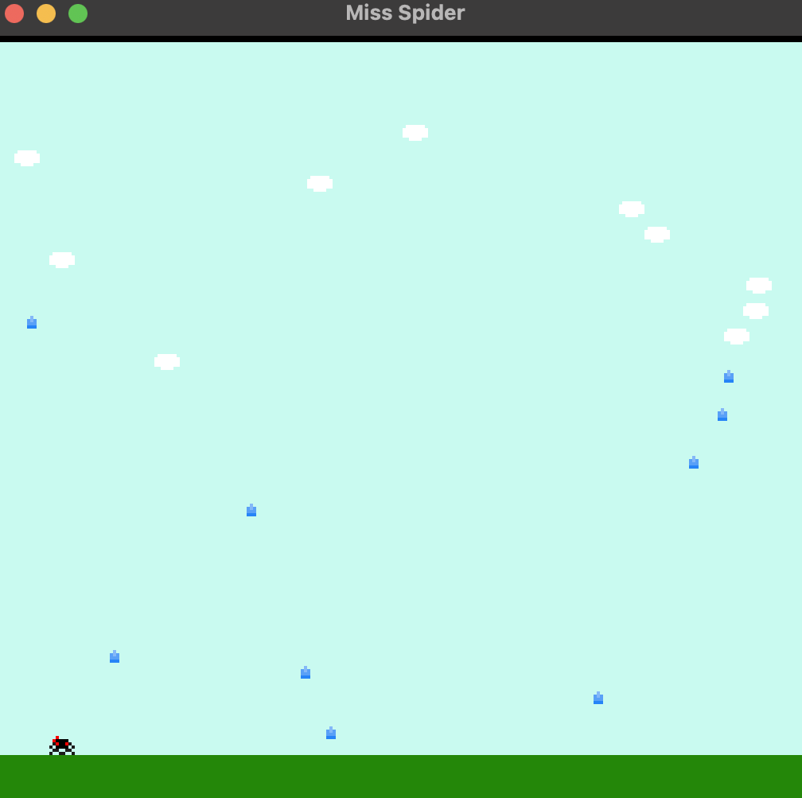

# Miss Spider

Author: Katherine Wang

Design: My game has a cute theme and uses randomized cloud movement to make raindrop falling more interesting.

Screen Shot:

How Your Asset Pipeline Works:

1. First, I created a 32 x 32 pixel sprite sheet of 16 packed sprites. Each of them are 8 x 8 pixels. The sprite sheet must be named sprites.png.
2. I get the file path for my sprite sheet using the data_path function and then use the load_png function to extract the pixel data for the image.
3. I parse the pixels for each sprite and assign each pixel a number from 0-3 depending on the color pattern, making sure that each sprite only has a maximum of 4 colors (including transparent).
4. Once the pixels in a sprite are assigned numbers, I parse out the 0 and 1 bit out of the number to make the bit0 and bit1 bit maps for the sprite. Once this data is complete, I can add the sprite to the tile table as a tile.
5. I manually created the palettes for my sprites and set the background using the ground and sky tiles.
6. Finally, I set the player (spider) sprites, cloud sprites, and raindrop sprites so that I could use them for my game.

How To Play:

Use the left and right arrow keys to move Miss Spider. Avoid the falling raindrops. If a raindrop hits you, it is game over!

Sources: I made my sprites myself at https://www.piskelapp.com.

This game was built with [NEST](NEST.md).

